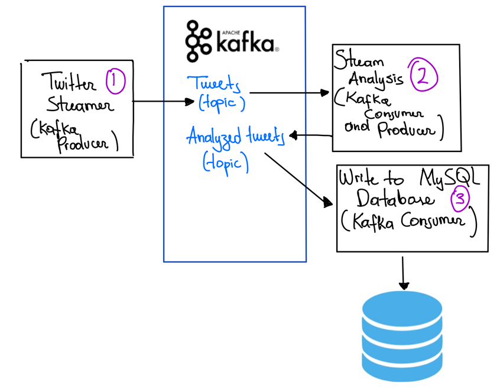

# Apache Kafka POC (WIP)

This is a POC to explore how to create an application that predicts **streaming data** in real time using state-of-the-art 
NLP models. To do so, we make extensive use of **Apache Kafka**'s python client and the **Hugging Face** library.

## Project's Architecture

This repository is a POC to demonstrate how one would 
analyze *COVID-19* related tweets in real time. The project works thus:



1. By taking advantage of Twitter's *Streaming* API, an Apache Kafka **Producer** writes the tweets into an **Apache Kafka's topic** inside a Kafka server.
   
1. Then, an Apache Kafka **Consumer** reads the tweets and uses pre-trained Hugging Face's 
models to perform sentiment and topic classification; finally, this very same server creates a **Producer** to write the 
modelling results back to another **Apache Kafka topic**.

1. At last, a final **Apache Kafka Consumer** reads the modelling results
and writes them into a **MySQL database**. 
   
1. In order to analyze the data, you can check a live dashboard of the results with the following python app:

```
conda env create -f environment.yml
conda activate docker-stats
voila data_analysis.ipynb
```

## Development environment

At the moment, this POC is in a dev environment where everything runs locally. In order to modularize the different 
components as much as possible, we've developed this application in a multi container environment: each of the components
runs on its very own Docker container. Therefore, we simulate as close as possible a real deployment scenario where each of the
components runs on a different (cluster of) server(s). 

# Running instructions

To run this application, you must have Docker and Docker-Compose installed in your machine. Please, clone this repository and run the following 
`docker-compose` command to build the required images:

```
docker-compose -f launch-kafka.yml build
```

Finally, run the following command to start all the components. 

```
docker-compose -f launch-kafka.yml up
```

Now the application is up and running! It's reading tweets in real time, processing them using state of the art NLP models,
classifying whether the tweet is positive or negative and then classifying the tweets into 14 different topics. Finally, the results
are written to a MySQL database hosted in AWS. All through the magic of Apache Kafka!


